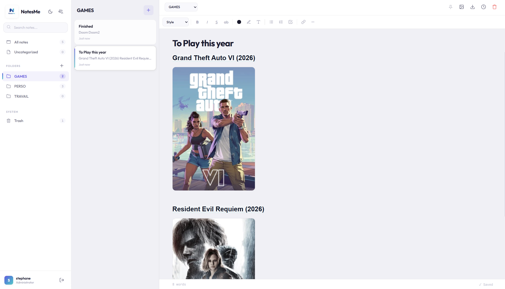

# 📝 NotesMe

Self-hosted note-taking app — lightweight, encrypted, deployable in one command. Zero frontend dependencies, end-to-end encryption at rest, built for speed.

I spent a long time looking for a simple, self-hosted note-taking application. I tested several, but I was never satisfied:
either too advanced, with too many features,
or too simplistic, lacking folder management, backups, etc.

So I decided to create this application myself, with Claude's help.
I'm happy with it, and I hope it will be useful to others.
I think its main strengths are its simplicity, its lightweight design, and its note versioning system.

Read on for all the details and features!


Some Screenshots:



---

## ✨ Features

**Editor**
- Rich WYSIWYG editor — bold, italic, underline, colors, headings, quotes, lists, code blocks
- Interactive checklists with checkboxes
- Drag & drop / paste images with visual resizing handles
- Link insertion with URL auto-detection and `Ctrl+K` shortcut
- Real-time autosave

**Organization**
- Folders and subfolders — unlimited nested hierarchy
- Pin important notes to the top
- Soft-delete trash with restore and configurable auto-purge
- Automatic version history (snapshots every 5 min, up to 50 per note)
- Export to plain text or HTML

**Security**
- AES encryption at rest (Fernet / AES-128-CBC + HMAC-SHA256)
- Argon2id password hashing (OWASP recommendation)
- In-memory search — decrypted text never touches the disk
- HTML sanitization client-side (DOMPurify) and server-side
- Path traversal, malicious upload and XSS protections
- Login rate limiting
- JWT authentication

**Multi-user**
- Admin user management panel
- Full data isolation between users
- Each user has their own notes, folders and trash

**Experience**
- Installable PWA — works as a native app on mobile and desktop
- Dark / light theme with automatic detection
- Responsive interface
- Vanilla JS — zero frameworks, instant load
- Keyboard shortcuts — `Ctrl+N` (new note), `Ctrl+B/I/U`, `Ctrl+K` (link)

---

## 🚀 Deployment

### Prerequisites

- Docker and Docker Compose

### Installation

```bash
# 1. Clone the repository
git clone https://github.com/stban1983/notesme.git
cd notesme

# 2. Create the environment file
cp .env.example .env

# 3. Edit .env with your values
#    - Set a strong password
#    - Generate an encryption key (see below)
nano .env

# 4. Launch
docker compose up -d
```

The app is available at `http://localhost:6807`.

### Generate an encryption key

```bash
python3 -c "from cryptography.fernet import Fernet; print(Fernet.generate_key().decode())"
```

or go to: https://8gwifi.org/fernet.jsp

> ⚠️ **Keep this key safe.** Without it, encrypted notes are permanently unrecoverable.

---

## ⚙️ Configuration

All variables are defined in the `.env` file:

| Variable | Default | Description |
|---|---|---|
| `USERNAME` | `admin` | Initial admin account username |
| `PASSWORD` | `admin` | Initial account password — **change this** |
| `SECRET_KEY` | *(auto)* | JWT signing key (auto-generated if empty) |
| `ENCRYPTION_KEY` | *(empty)* | Fernet key for note encryption (optional) |
| `TOKEN_EXPIRY_HOURS` | `72` | Session duration in hours |
| `TRASH_RETENTION_DAYS` | `30` | Days before automatic trash purge |
| `MAX_UPLOAD_SIZE` | `10485760` | Max upload size in bytes (10 MB default) |
| `VERSION_INTERVAL_MIN` | `5` | Minimum interval between version snapshots (minutes) |
| `MAX_VERSIONS_PER_NOTE` | `50` | Maximum versions kept per note |
| `LOGIN_MAX_ATTEMPTS` | `5` | Login attempts before lockout |
| `LOGIN_WINDOW_SEC` | `900` | Lockout window in seconds (15 min default) |

---

## 🔒 Security

### Encryption

Encryption is **optional** and only enabled when `ENCRYPTION_KEY` is set.

- **Algorithm**: AES-128-CBC + HMAC-SHA256 via Fernet (`cryptography` library)
- Note content is encrypted before being written to the SQLite database
- Titles and metadata are **not** encrypted (needed for sorting)
- Images are **not** encrypted (stored as files on the volume)
- The full-text search index (FTS) has been removed — search runs in-memory after decryption, ensuring no plaintext ever persists on disk

### Passwords

- Hashed with **Argon2id** (OWASP 2024 recommendation)
- Transparent migration: legacy SHA-256 hashes are automatically upgraded to Argon2 on the next successful login — no user action required

### Attack protections

- **XSS**: DOMPurify sanitization client-side with a tag whitelist, `html.escape()` server-side for exports
- **Path traversal**: `basename()` + `realpath()` validation on the image endpoint
- **Malicious uploads**: SVG banned (XSS vector), extension forced from MIME type, configurable size limit
- **Brute force**: per-IP rate limiting on the login endpoint (5 attempts / 15 min by default)


---

## 📁 Data structure

The `./data` volume contains:

```
data/
├── notes.db      # SQLite database (notes, folders, users, versions)
└── uploads/      # Uploaded images (UUID.ext)
```

> 💡 Back up this directory regularly, along with your encryption key.

---

## 🏗️ Tech stack

| Component | Technology |
|---|---|
| Backend | Python 3.12, FastAPI, SQLite (WAL mode), Fernet, Argon2 |
| Frontend | Vanilla JS, HTML/CSS — zero frameworks, zero bundlers |
| Sanitization | DOMPurify (CDN) |
| Auth | JWT (PyJWT) |
| Container | `python:3.12-slim` (~90 MB) |
| PWA | Service Worker + manifest.json |

---

## ⌨️ Keyboard shortcuts

| Shortcut | Action |
|---|---|
| `Ctrl + N` | New note |
| `Ctrl + B` | Bold |
| `Ctrl + I` | Italic |
| `Ctrl + U` | Underline |
| `Ctrl + K` | Insert link |
| `Ctrl + Shift + X` | Strikethrough |
| `Ctrl + Shift + L` | Bullet list |

---

## 📄 License

MIT
